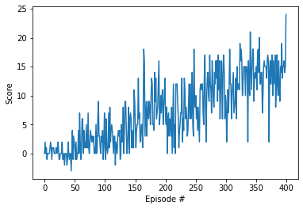

# Project 1: Navigation

### Learning Algorithm
For this project, a Deep Q-Network (DQN) was used. 
DQN combine Q-Learning with deep neural networks. 
Q-Learning is an RL algorithm based on a Q-function (the state-action value function). The Q-function of a policy measures the expected return or discounted sum of rewards obtained from state s by taking action a first and following policy pi thereafter. Goal of the learning procedure is to find the optimal Q-function iteratively by updating the Q-value of the respective state-action-pair using the Bellman optimality equation. 
As it is commonly impractical to represent the Q-function as a table, DQN uses a neural network to approximate the Q-function. During learning, the network's parameters are updated in order to minimize the temporal difference (TD) error. In other words, we use a fixed network from the previous iteration in order to calculate the TD target (target network) and then optimize the parameters of the local network in order to minimize the deviation from this target. 
Q-learning is an off-policy algorithm that uses different policies for exploitation (greedy) and exploration (epsilon-greedy)  

The DQN receives the state (37-dimensional) as input and predicts the the corresponding action values for each possible game action. In order to capture temporal information, a stack of several states is given as input to the DQN. The agent acts based on an epsilon-greedy policy. The DQN learns based on the following hyperparameters:
- replay buffer size = 100000
- minibatch size = 64
- discount factor = 0.99
- TAU = 0.003            
- learning rate = 0.0005
- update frequency of the network (every n iterations) = 4
- epsilon start = 1
- epsilon end = 0.01
- epsilon decay = 0.995

The network used has the following characteristics:
- number of hidden layers = 2
- input size = 37 (dimension of state space)
- output size = 4 (dimension of action space)
- number of nodes in first hidden layer = 64
- number of nodes in second hidden layer = 64
- activation function (between input & first hidden layer, first & second hidden layer) = Relu

### Plot of Rewards

The agent is able to solve the environment after 400 episodes as the below reward plot shows:

### Ideas for Future Work

The implementation from this repo is a basic DQN agent that can surely be improved in the future. Possible improvements are:
- Double DQN in order to deal with overestimation of action values
- Prioritized Experience Replay in order to increase learning effectiveness by prioritizing certain experiences from replay memory
- Dueling DQN in order to assess the value of each state, without having to learn the effect of each action
- Others (multi-step bootstrap targets, Distributional DQN, Noisy DQN)
- Rainbow (combination of above 6 improvements)

