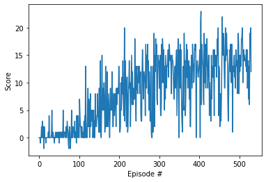

# Project 1: Navigation

### Learning Algorithm
For this project, a Deep Q-Network (DQN) was used. It receives the state (37-dimensional) as input and predicts the the corresponding action values for each possible game action. In order to capture temporal information, a stack of several states is given as input to the DQN. The agent acts based on an epsilon-greedy policy. The DQN learns based on the following hyperparameters:
- replay buffer size = 100000
- minibatch size = 64
- discount factor = 0.99
- TAU = 0.003            
- learning rate = 0.0005
- update frequency of the network (every n iterations) = 4
- epsilon start = 1
- epsilon end = 0.01
- epsilon decay = 0.995

The network used has the following characteristics:
- number of hidden layers = 2
- input size = 37 (dimension of state space)
- output size = 4 (dimension of action space)
- number of nodes in first hidden layer = 64
- number of nodes in second hidden layer = 64
- activation function (between input & first hidden layer, first & second hidden layer) = Relu

### Plot of Rewards

The agent is able to solve the environment after 400 episodes as the below reward plot shows:

### Ideas for Future Work

The implementation from this repo is a basic DQN agent that can surely be improved in the future. Possible improvements are:
- Double DQN in order to deal with overestimation of action values
- Prioritized Experience Replay in order to increase learning effectiveness by prioritizing certain experiences from replay memory
- Dueling DQN in order to assess the value of each state, without having to learn the effect of each action
- Others (multi-step bootstrap targets, Distributional DQN, Noisy DQN)
- Rainbow (combination of above 6 improvements)

