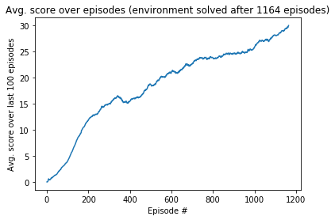

# Report Project 2: Continuous Control

### Introduction
In this project we implemented the algorithm from the [Continuous Control with Deep Reinforcement Learning](https://arxiv.org/pdf/1509.02971.pdf) paper (Lillicrap et al)[1]. The algorithm called Deep Deterministic Policy Gradients (DDPG) is model-free, off-policy and actor-critic, using deep neural networks in order to learn policies in high-dimensional, continuous action spaces.

The DDPG implementation was used to solve the [Reacher](https://github.com/Unity-Technologies/ml-agents/blob/master/docs/Learning-Environment-Examples.md#reacher) environment[2], an environment that provides a double-jointed arm that can move to target locations. For this specific environment a single double-jointed arm was provided.

### Learning Algorithm
DDPG has been implemented in the files, based on the [solution](https://github.com/udacity/deep-reinforcement-learning/blob/55474449a112fa72323f484c4b7a498c8dc84be1/ddpg-bipedal) of the bipedal environment made by [Udacity](https://www.udacity.com) for the [Deep Reinforcement Learning NanoDegree](https://eu.udacity.com/course/deep-reinforcement-learning-nanodegree--nd893):

    ddpg_agent.py - contains the implementation of the agent and hyperparameters
    model.py - Contains the implementation of the Actor and Critic

The following Hyperparameters have been used to solve the environment, however, they can be adjusted:

	BUFFER_SIZE = int(1e6)  # replay buffer size
	BATCH_SIZE = 128        # minibatch size
	GAMMA = 0.99            # discount factor
	TAU = 1e-3              # for soft update of target parameters
	LR_ACTOR = 1e-4         # learning rate of the actor 
	LR_CRITIC = 1e-3        # learning rate of the critic
	WEIGHT_DECAY = 0        # L2 weight decay
	UPDATE_EVERY = 20       # step frequency for target network update
	NO_UPDATES = 10         # 10 updates at a 
	EPSILON = 0.9           # epsilon for the noise process added to the actions
	EPSILON_DECAY = 0.999   # decay for epsilon above
	EPS_END = 0.1           # final epsilon value

The architectures are fully connected neural networks with following dimensions:

    - Actor: 128 -> 64 -> 32
    - Critic: 256 -> 128 -> 64

### Results and Plot of Rewards
By executing the instructions in `Continuous_Control.ipynb` we were able to get the agent to be able to solve the of getting an average score of at least +30 in last 100 episodes, in 1164 episodes with an average score of 30.02.

here is graph of increase of score over time (number of episodes):

### Ideas for future work
One option for improvement is to improve the present DDPG implementation, especially to avoid slowed learning after 200-300 episodes (see plot), preferably through:

- Hyperparameters tunning
- Modifying the network architectures of actor and critic
- Using batch normalization during training

Another option is to modify the current algorithm by implementing Priority Experienced Replay 

- Priority Experienced Replay means that important experience will be sampled more often from the buffer. Based on the [A novel DDPG method with prioritized experience replay] (https://www.semanticscholar.org/paper/A-novel-DDPG-method-with-prioritized-experience-Hou-Liu/027d002d205e49989d734603ff0c2f7cbfa6b6dd) paper (Hou et al)[3], it can reduce the training time, improve the stability of the training process and is less sensitive to the change in hyperparameters.

### References

[1][Continuous Control with Deep Reinforcement Learning](https://arxiv.org/pdf/1509.02971.pdf) paper (Lillicrap et al)

[2][Unity Reacher Environment](https://github.com/Unity-Technologies/ml-agents/blob/master/docs/Learning-Environment-Examples.md#reacher)

[3][A novel DDPG method with prioritized experience replay] (https://www.semanticscholar.org/paper/A-novel-DDPG-method-with-prioritized-experience-Hou-Liu/027d002d205e49989d734603ff0c2f7cbfa6b6dd) paper (Hou et al)