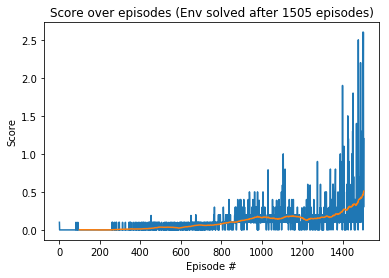

# Report Project 3: Collaboration & Competition

### Introduction
In this project we implemented the algorithm called Deep Deterministic Policy Gradients (DDPG) with two DDPG agents, therefore a multi-agent DDPG (MADDPG). 
DDPG is model-free, off-policy and actor-critic, using deep neural networks in order to learn policies in high-dimensional, continuous action spaces.
As DDPG is actor-critic, it contains two neural networks, namely the Actor and the Critic. The Actor estimates the optimal policy for a given problem. The Critic estimates the cumulative episodic reward for each State-Action tuple.

The MADDPG implementation was used to solve the [Tennis](https://github.com/Unity-Technologies/ml-agents/blob/master/docs/Learning-Environment-Examples.md#tennis)[1] environment. In this environment, two agents control rackets to bounce a ball over a net. If an agent hits the ball over the net, it receives a reward of +0.1.  If an agent lets a ball hit the ground or hits the ball out of bounds, it receives a reward of -0.01.  Thus, the goal of each agent is to keep the ball in play.

This project uses two agents, each with its own actor and its own critic. In theory, the agents are working in competition (achieve a hogher score than opponent). In this implementation however, the agents are working collaboratively to keep the ball in air, leading to mutual benefits.   

### Learning Algorithm
DDPG has been implemented in the files, loosely based on the [solution](https://github.com/udacity/deep-reinforcement-learning/blob/55474449a112fa72323f484c4b7a498c8dc84be1/ddpg-bipedal) of the bipedal environment made by [Udacity](https://www.udacity.com) for the [Deep Reinforcement Learning NanoDegree](https://eu.udacity.com/course/deep-reinforcement-learning-nanodegree--nd893):

    ddpg_agent.py - contains the implementation of the agent and hyperparameters
    model.py - Contains the implementation of the Actor and Critic
    noise.py - Implements the OUNoise
    buffer.py - Implements the replay buffer used by both agents

The following Hyperparameters have been used to solve the environment, however, they can be adjusted:

	BUFFER_SIZE = int(1e6)  # replay buffer size
	BATCH_SIZE = 256        # minibatch size
	GAMMA = 0.99            # discount factor
	TAU = 1e-3              # for soft update of target parameters
	LR_ACTOR = 1e-4         # learning rate of the actor 
	LR_CRITIC = 1e-3        # learning rate of the critic
	WEIGHT_DECAY = 0        # L2 weight decay
	UPDATE_EVERY = 1       # step frequency for target network update
	NO_UPDATES = 1         # 10 updates at a 

The architectures are fully connected neural networks with following dimensions:

    - Actor: 256 -> 128
    - Critic: 256 -> 128 -> 128

### Results and Plot of Rewards
By executing the instructions in `Tennis.ipynb` we were able to get the agent to reaching an average score of at least +0.5 in last 100 episodes, in 1505 episodes with an average score of 0.51.

Here you can find a graph of the score (avg. of last 100 episodes) over time (number of episodes):

### Ideas for future work
One option for improvement is to improve the present DDPG implementation, especially to avoid slowed learning after 1000 episodes (see plot), preferably through:

- Hyperparameters tunning
- Modifying the network architectures of actor and critic
- Using batch normalization during training

Another option is to modify the current algorithm by implementing Priority Experienced Replay 

- Priority Experienced Replay means that important experience will be sampled more often from the buffer. Based on the [A novel DDPG method with prioritized experience replay] (https://www.semanticscholar.org/paper/A-novel-DDPG-method-with-prioritized-experience-Hou-Liu/027d002d205e49989d734603ff0c2f7cbfa6b6dd) paper (Hou et al)[2], it can reduce the training time, improve the stability of the training process and is less sensitive to the change in hyperparameters.

### References

[1][Unity Tennis Environment](https://github.com/Unity-Technologies/ml-agents/blob/master/docs/Learning-Environment-Examples.md#tennis)

[2][A novel DDPG method with prioritized experience replay](https://www.semanticscholar.org/paper/A-novel-DDPG-method-with-prioritized-experience-Hou-Liu/027d002d205e49989d734603ff0c2f7cbfa6b6dd) paper (Hou et al)